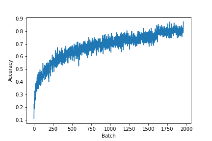

# PyTorch Trainer

A module for handling the training logic for PyTorch models. The Trainer classes act as the [information expert](https://en.wikipedia.org/wiki/GRASP_(object-oriented_design)#Information_expert) for the training data and metrics for running model training. Essentially all information needed to fullfill training and generated via training will be handled by these classes. This helps to reduce repeated code and produce easily traceable ML code.

The trainers are meant to be used with base PyTorch. PyTorch already has simple and flexible methods for implementing neural networks, data loaders, and various training components. What's missing is a unified API for running training for common tasks.

```python
from pytorchtrainer.trainers import SingleOutputTrainer

net = torchvision.models.resnet18()

# set up our trainer
trainer = SingleOutputTrainer(
    net = net,
    train_loader = train_loader,
    valid_loader = valid_loader,
    crit = nn.CrossEntropyLoss(),
    device = torch.device('cuda'),
    optimizer = torch.optim.AdamW(net.parameters(), lr=0.001),
    epochs = 100,
)

# train the network
trainer.train_network()
```

## Installation

```
git clone https://github.com/FlorianMuellerklein/PyTorchTrainer.git
cd PyTorchTrainer
pip install .
```

## Using the Trainer

### Arguments:

* **net**: A torch.nn.Module that produces predictions on the images
    and whose weights are updated via the optimizer

* **train_loader**: An iteratble that returns batches of (inputs, targets)

* **valid_loader**: An iteratble that returns batches of (inputs, targets)

* **crit**: A single or list of loss functions to apply to the output of the network

* **crit_lambdas**: A list of loss function scaling lambdas to apply to each loss

* **metrics**: A list of optional metrics to use to track learning progress outside of the loss function.
    Must accept inputs in the form of metric(y_true, y_score), following sklearn convention for compatibility

* **metric_names**: An optional list of metrics names to be used during tracking and saving. If not supplied
    will use the function names for each metrics

* **epochs**: How many epochs to use for training

* **optimizer**: The torch optimizer function, can be any supplied by PyTorch

* **scheduler**: Optional PyTorch learning rate scheduler

* **mixed_precision**: Whether to use mixed precision training or not

* **device**: Whether to use any supported accelerator, for example a GPU

* **checkpoint_every**: How often to save model weights

* **checkpoint_dir**: Directory to save model weights

* **model_name**: The name of the model for saving weights

* **tb_writer**: An optional tensorboard writer for logging

### Attributes:

* **iterations**: tracks the total number of gradient updates

* **losses**: tracks the loss values for each batch

* **metric_tracking**: trackes the metric values for each batch

## Metric Tracking

The loss values and supplied metrics will be tracked for both training and validation.They can be plotted easily by retrieving the attributes from the class.

```
plt.plot(trainer.metric_tracking['Accuracy']['train'])
plt.ylabel('Accuracy')
plt.xlabel('Batch')
plt.show()
```

